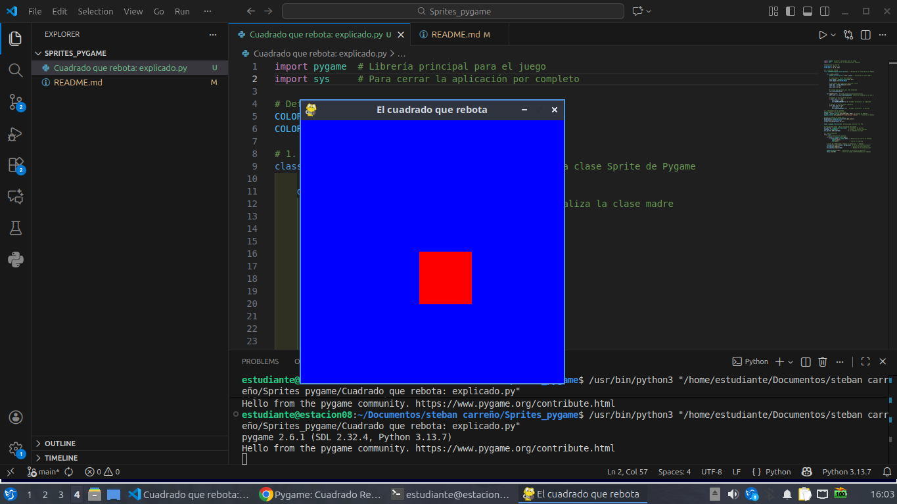

# Sprites_pygame
**Colegio San José de Guanentá** **Especialidad:** Sistemas | **Grado:** 10°  
**Tema:** Desarrollo de Videojuegos con Pygame (Sprites, Grupos y POO)

---

## 📄 1. Síntesis de Conceptos Principales

A partir del material de estudio suministrado, se sintetizan los pilares fundamentales para el desarrollo de videojuegos en Pygame utilizando el paradigma orientado a objetos:

* **¿Qué es un Sprite?** Es una "imagen-objeto" dentro de la programación. Unifica sistemáticamente una representación gráfica (imagen o superficie), una ubicación geométrica en la ventana y un conjunto de atributos/propiedades (nombres, estados booleanos de movimiento, etc.) que se actualizan frame a frame.
* **La noción de Grupo (Group):** Es una colección estructurada que agrupa múltiples objetos de un mismo tipo. Permite la optimización del desarrollo al aplicar actualizaciones, limpiezas y dibujos masivos en una sola línea de código dentro del bucle del juego, evitando código redundante.
* **Gestión de Colisiones:** Es el control matemático y geométrico que detecta el encuentro entre dos objetos gráficos en pantalla. Pygame simplifica enormemente este proceso mediante funciones nativas integradas en los objetos que heredan de la clase Sprite.
* **Paradigma de Objetos en Python:**
    * **Clase:** El molde o plantilla conceptual unificadora.
    * **Atributo:** Las variables internas que describen las características de la clase.
    * **Método:** Funciones internas encargadas de ejecutar las acciones de la instancia.
    * **Inicializador (`__init__`):** El método obligatorio encargado de construir e inicializar las variables de una nueva instancia en memoria.
    * **Herencia:** Mecanismo de factorización que permite a una clase hija beneficiarse directamente de los atributos y métodos de una clase padre, expandiendo sus capacidades específicas.

---

## 📦 2. Ilustración Gráfica de Objetos en Memoria

Cuando ejecutas este programa, Python reserva espacios específicos en la memoria RAM organizados bajo la estructura de la Programación Orientada a Objetos. A continuación, se detalla esquemáticamente cómo se distribuyen estas referencias:

```text
       [ MEMORIA RAM DE LA APLICACIÓN ]
       
 ┌────────────────────────────────────────────────────────┐
 │ 1. CLASE MADRE: pygame.sprite.Sprite                   │
 └───────────────────────────▲────────────────────────────┘
                             │ (Hereda estructura base)
 ┌───────────────────────────┴────────────────────────────┐
 │ 2. CLASE HIJA: CUADRADO                                │
 │    - Método: __init__(self)                            │
 │    - Método: update(self)                              │
 └───────────────────────────▲────────────────────────────┘
                             │ (Instanciación)
 ┌───────────────────────────┴────────────────────────────┐
 │ 3. INSTANCIA EN MEMORIA: 'cuadrado'                    │
 │    - self.image ----------> [ Objeto pygame.Surface ]  │
 │                              (Dimensiones: 80x80 px)   │
 │                              (Color: ROJO)             │
 │    - self.rect -----------> [ Objeto pygame.Rect ]     │
 │                              (x: 200, y: 200, w:80,h:80)
 │    - self.DESPLAZAMIENTO -> [ Entero: 3 ]              │
 └───────────────────────────▲────────────────────────────┘
                             │ (Almacenado como referencia)
 ┌───────────────────────────┴────────────────────────────┐
 │ 4. CONTENEDOR: all_sprites                             │
 │    - Tipo: pygame.sprite.Group()                       │
 │    - Colección: [ Lista de referencias a instancias ]  │
 │      👉 Contiene una referencia directa a 'cuadrado'   │
 └────────────────────────────────────────────────────────┘
```
 Aquí se adjunta la captura que demuestra el correcto funcionamiento del rebote del cuadrado y la renderización en la pantalla de Pygame:
 

- **Comportamiento observado**: Al iniciar, el objeto se sitúa en el centro y se desplaza sumando píxeles en su eje X. Al colisionar geométricamente con el límite establecido de 320, el método update altera el signo del desplazamiento, generando de manera limpia el efecto visual de rebote autónomo.